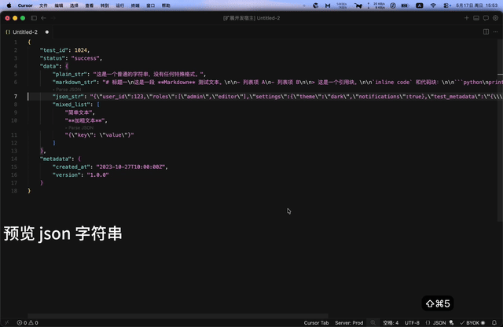

<p align="center">
  
</p>

# BetterJsonExplorer

VS Code 扩展：更好的 JSON 预览与编辑工具。

## 功能演示

### 1. 智能识别与格式化


### 2. JSON 格式一键切换（默认 Cmd+;）


### 3. 任意字符串 Hover 预览与嵌套解析


## 功能

1. **智能识别与格式化**：新建文件时，粘贴内容若为合法 JSON 或 JSON 字符串，自动切换语言模式为 JSON 并格式化
2. **JSON 格式切换**：JSON/JSONC 文件中使用默认快捷键 `Cmd+;`（Windows/Linux 为 `Ctrl+;`）在 JSON 格式和 JSON 字符串之间切换
3. **任意字符串值的 Hover 预览**：JSON 中所有 string 值都支持鼠标悬停预览，并按内容智能选择渲染方式
   - **嵌套 JSON**（如 `"{\"a\":1}"`）→ 展开为格式化 JSON 渲染
   - **Markdown 文本**（标题/列表/代码围栏/链接/表格等）→ 直接以 markdown 渲染
   - **纯文本/代码** → code block 等宽显示，转义字符（`\n`/`\t`）按真实换行/制表展示
   - Hover 浮窗底部带 `▸ Open ... in side panel` 链接，点击在右侧分栏新开 untitled 文档：
     - 嵌套 JSON → `Parsed-<keyPath>.json`
     - Markdown → `Value-<keyPath>.md`（可用 `Cmd+Shift+V` 触发 markdown 预览）
     - 纯文本 → `Value-<keyPath>.txt`
   - 多次点击会在右侧同一分栏增加 Tab，互不覆盖；新文档本身也是 JSON / Markdown 文档，因此**递归支持任意深度嵌套**
4. **嵌套 JSON 字符串 CodeLens**：可解析为 JSON 对象/数组的字符串值上方会显示 `▸ Parse JSON` 行内按钮，等价于 Hover 链接的快捷入口（纯文本/markdown 不会显示 CodeLens，避免噪音）

## 快捷键

- 默认快捷键：macOS `Cmd+;`，Windows/Linux `Ctrl+;`
- 如需修改，请使用 VS Code 自带的 **Keyboard Shortcuts**，搜索命令 `BetterJsonExplorer: Toggle Current Document JSON Format/String`
- 对应的 command ID 是 `better-json-explorer.toggleCurrentDocument`

如果想直接在 `keybindings.json` 中重绑，可以添加类似配置：

```json
{
  "key": "cmd+alt+j",
  "command": "better-json-explorer.toggleCurrentDocument",
  "when": "editorTextFocus && (editorLangId == json || editorLangId == jsonc)"
}
```

## 示例

把下面这段贴进一个 JSON 文件，悬停每个 string 值观察 Hover 不同表现：

````json
{
    "test_id": 1024,
    "status": "success",
    "data": {
        "plain_str": "这是一个普通的字符串，没有任何特殊格式。",
        "markdown_str": "# 标题一\n这是一段 **Markdown** 测试文本。\n\n- 列表项 A\n- 列表项 B\n\n> 这是一个引用块。\n\n`inline code` 和代码块：\n\n```python\nprint('hello world')\n```",
        "json_str": "{\"user_id\": 123, \"roles\": [\"admin\", \"editor\"], \"settings\": {\"theme\": \"dark\", \"notifications\": true}}",
        "mixed_list": [
            "简单文本",
            "**加粗文本**",
            "{\"key\": \"value\"}"
        ]
    },
    "metadata": {
        "created_at": "2023-10-27T10:00:00Z",
        "version": "1.0.0"
    }
}
````

预期 Hover 行为：

| 字段 | Hover 类型 | 右侧打开为 |
|---|---|---|
| `status` / `metadata.version` / `data.plain_str` / `data.mixed_list[0]` | **String value**（code block 等宽） | `.txt` |
| `data.markdown_str` | **Markdown**（标题/列表/引用/代码块原生渲染） | `.md` |
| `data.json_str` / `data.mixed_list[2]` | **Parsed JSON**（同时显示 CodeLens `▸ Parse JSON`） | `.json` |
| `data.mixed_list[1]` `"**加粗文本**"` | **String value**（长度不足 20 字符 + 单一信号，归类为 text） | `.txt` |

## 开发

```bash
yarn install          # 安装依赖
yarn compile          # 编译 TypeScript
yarn watch            # 监听模式编译
yarn lint             # ESLint 检查
yarn test             # 运行测试（需先 compile + lint）
```

按 F5 启动 Extension Development Host 调试。
